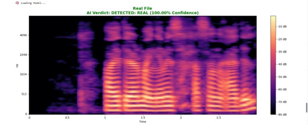
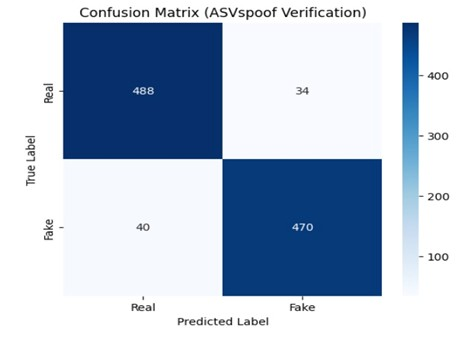

# 🎙 VoiceGuard: Audio Deepfake & Spoof Detection
## 📌 Overview
**VoiceGuard** is an intelligent system for detecting **AI-generated and spoofed voices**.  
It targets fake audio produced by **Text-to-Speech (TTS)** and **Voice Conversion (VC)** models, which pose a growing threat to voice authentication and digital security systems.

The project combines:
- **Deep Learning (CNN)** for spectrogram-based detection
- **Traditional Machine Learning (Random Forest)** for MFCC-based verification

---

## 🚨 Problem Statement
Recent advances in AI voice synthesis allow attackers to clone a person’s voice using only a few seconds of audio.  
This enables:
- Voice biometric fraud  
- Social engineering attacks  
- Financial scams  
- Fake audio manipulation  

Traditional security systems struggle to detect these attacks reliably.

---

## 🎯 Objectives
- Detect AI-generated audio deepfakes
- Analyze acoustic artifacts introduced by TTS and VC models
- Classify audio as **Real** or **Fake** with high confidence
- Compare Deep Learning and Classical ML approaches

---

**Pipeline:**
1. Audio Input  
2. Feature Extraction (Mel-Spectrogram)  
3. CNN or Random Forest Model  
4. Real / Fake Decision  

---

## 📊 Dataset
- **ASVspoof 2019 – Logical Access (LA)**
- Contains real speech and synthetic audio generated by multiple TTS and VC algorithms

---

## 🔊 Preprocessing
Using **Librosa**:
- Resampling audio
- Spectrogram generation
- MFCC extraction
- Fixed-length padding and normalization

---

## 🧠 Models

### 1️⃣ CNN-Based Deepfake Detector
- **Input:** Mel-Spectrograms  
- **Goal:** Learn frequency-domain artifacts introduced by AI voice generation  
- **Framework:** TensorFlow / Keras  

The CNN processes audio signals as spectrogram images and learns subtle patterns
that distinguish **real human speech** from **synthetic (AI-generated) voices**.

---
## 🔊 Example Predictions

### ✅ Real Audio Sample
The following spectrogram represents a **genuine human voice**.
It shows smooth and natural frequency transitions over time.

  

**Model Prediction:**  
✔️ **REAL** (High Confidence)

---

### 🚨 Fake (AI-Generated) Audio Sample
This spectrogram corresponds to a **synthetic voice** generated using
Text-to-Speech (TTS) or Voice Conversion (VC) techniques.  
Notice the irregular frequency patterns and unnatural spectral artifacts.

  

**Model Prediction:**  
❌ **FAKE** (High Confidence)

---
## 🧮 Random Forest Verification Results

### Confusion Matrix (ASVspoof 2019 – LA)

The confusion matrix below illustrates the performance of the
**Random Forest classifier** trained on **MFCC features** extracted from the
ASVspoof 2019 dataset.

  

### 📊 Analysis
- The majority of **real** and **fake** samples are classified correctly.
- Low **false positive rate** helps prevent misclassification of genuine voices.
- Low **false negative rate** improves detection of spoofed audio.
- The Random Forest model provides a strong **baseline verification approach**
  that complements the CNN-based deepfake detector.
